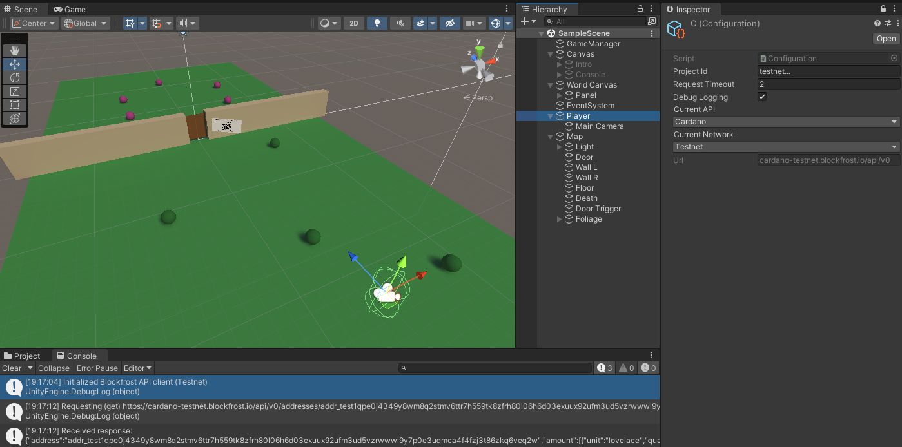

<a href="https://fivebinaries.com/"></a>

# Cardano games assets for Unity

This repository contains the code and configuration files of Cardano game assets for Unity.

It is a lighthweight Unity-specific client for interacting with blockfrost.io API. It's built on [UniTask](https://github.com/Cysharp/UniTask) for allocation-free async operations and uses Unity's native HTTP client (`UnityWebRequest`) and JSON parser (`JsonUtility`).

<p align="center">
  <a href="#installation">Installation</a> •
  <a href="#usage">Usage</a> •
  <a href="#demo">Demo</a> 
</p>
<br><br>

## Installation

### Unity Asset Store

We're going to publish this package to the Asset Story in the near future.

### Package Manager

Client can be installed using Unity Package Manager using git.

* Go to Package Manager, select *Add package from git URL...* 
* Enter `https://github.com/fivebinaries/cardano-unity.git?path=src/Blockfrost.io`

NOTE: Dependancy has to be installed manually if they are missing, see [Installing UniTask](https://github.com/Cysharp/UniTask#install-via-git-url).

### Manual installation

You can copy [Blockfrost.io](src/Blockfrost.io) folder into your project. Installing dependancy is required.

## Usage

### Getting started

1. Get your own `PROJECT_ID` from [blockfrost.io](https://blockfrost.dev/docs/overview/getting-started#creating-first-project)
2. Create configuration _Create_ → _Blockfrost.io API_ → _Configuration_ and fill in the `PROJECT_ID`
3. In your MonoBehaviour create new instance of _Blockfrost.API_ by passing in reference to your configuration
4. You can now call the API and access the Cardano blockchain

### Example

```csharp
var config = new Blockfrost.Configuration{
  ProjectID = myProjectID;
};

var client = Blockfrost.API(config);
var latestBlock = await client.GetLatestBlock();

Debug.Log(response.hash);
```

### Listing

Some endpoints allow certain listing operations (number of items in a list, order, .etc). There are three filters available
`Blockfrost.Listing`, `Blockfrost.OrderedListing`, and `Blockfrost.TargetableOrderedListing` that can be passed to specific methods.

```csharp
api.GetBlockTransactions(hash, new Listing{count = 10})
```

### Errors

Errors from `UnityWebRequest` are returned as is.

## Demo

Demo using [Nami wallet](https://namiwallet.io/) can be found [here](https://fivebinaries.github.io/cardano-unity/src/Examples/Demo/) and its sources [here](src/Examples).
